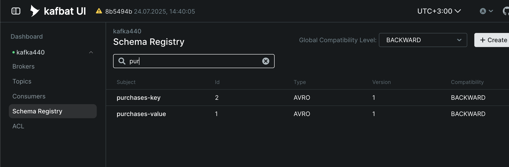
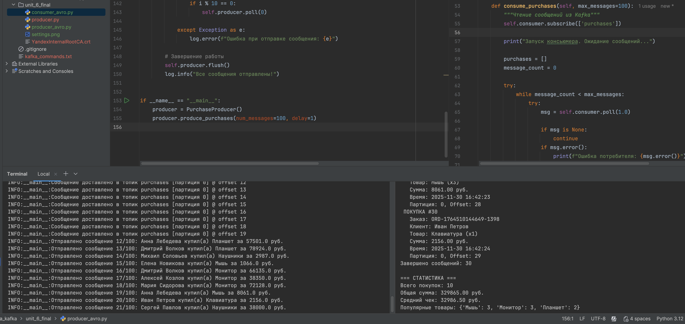
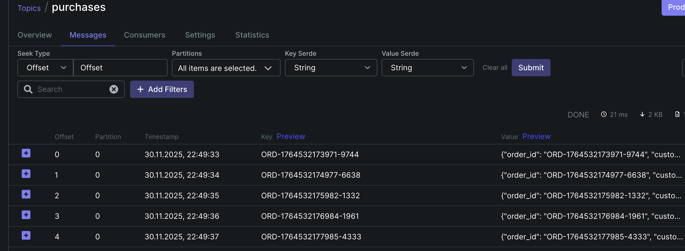
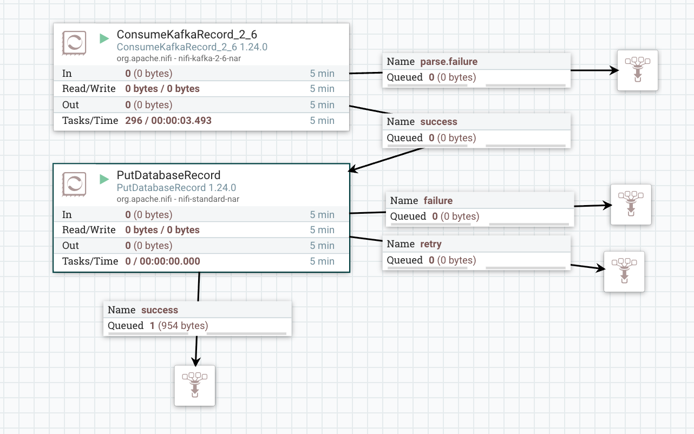
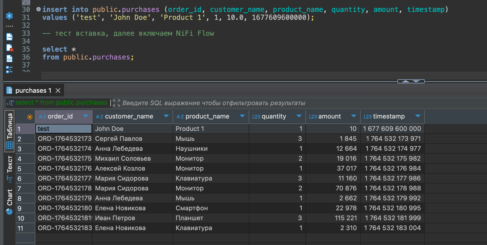

# Развертывание и настройка Kafka-кластера в Yandex Cloud

## Описание проекта
Проект включает развертывание отказоустойчивого Kafka-кластера в Yandex Cloud с последующей настройкой для продакшн-среды, реализацией продюсера и консьюмера с Avro схемами.

## Выполненные шаги

### Шаг 1: Развертывание Kafka-кластера

#### Конфигурация брокеров
- **Количество брокеров**: 3
- **Конфигурация каждого брокера**:
  - **vCPU**: 4 ядра (желательно 12+)
  - **RAM**: 8 ГБ (желательно 32-64)
  - **Диски**: 3 сетевых SSD по 100 ГБ каждый (смотреть по объемам, 500+)
  - **Общий объем хранилища**: 300 ГБ

#### Обоснование выбора ресурсов
Данная конфигурация обеспечивает:
- Отказоустойчивость при выходе из строя одного брокера
- Достаточную производительность для обработки средних нагрузок
- Резерв дискового пространства для роста данных

### Шаг 2: Настройка репликации и хранения данных

#### Создание топика

Название - purchases, количество партиций - 3, количество реплик - 3

#### Параметры топика
```properties
log.cleanup.policy=delete
log.retention.ms=604800000      # 7 дней
log.segment.bytes=1073741824    # 1 ГБ
min.insync.replicas=2
```

#### Проверка конфигурации топика
```bash
kafka-topics --describe \
  --topic purchases \
  --bootstrap-server rc1a-eoekpp9ig4p786n4.mdb.yandexcloud.net:9091 \
  --command-config client.properties
 ```

**Вывод команды:**
```
Topic: purchases        TopicId: zPKFdzdGQIWg1KH1VlBC7A PartitionCount: 3       ReplicationFactor: 3    Configs: min.insync.replicas=2,cleanup.policy=delete,follower.replication.throttled.replicas=*,segment.bytes=1073741824,retention.ms=604800000
        Topic: purchases        Partition: 0    Leader: 1       Replicas: 1,2,3 Isr: 1,2,3      Elr:    LastKnownElr: 
        Topic: purchases        Partition: 1    Leader: 2       Replicas: 2,3,1 Isr: 2,3,1      Elr:    LastKnownElr: 
        Topic: purchases        Partition: 2    Leader: 3       Replicas: 3,1,2 Isr: 3,1,2      Elr:    LastKnownElr: 
```

### Шаг 3: Настройка Schema Registry

Schema Registry был развернут как управляемый сервис в Yandex Cloud.

**Файл схемы value:** `purchase-key-schema.avsc`

**Файл схемы key:** `purchase-key-schema.avsc`

<br>

#### Проверка работы Schema Registry

**Запрос списка зарегистрированных схем:**
```bash
curl -u producer:password_producer \
  --cacert YandexInternalRootCA.crt \
  https://rc1a-eoekpp9ig4p786n4.mdb.yandexcloud.net:443/subjects
```

**Ответ:**
```json
["purchases-value","purchases-key"]%  
```

**Запрос информации о конкретной схеме:**
```bash
curl -u producer:password_producer \
  --cacert YandexInternalRootCA.crt \
  https://rc1a-eoekpp9ig4p786n4.mdb.yandexcloud.net:443/subjects/purchases-value/versions
```

**Ответ:**
```json
[1]
```

Скриншот:




### Шаг 4: Проверка работы Kafka

#### Реализация продюсера

**Код продюсера:** `producer.py`


#### Реализация консьюмера

**Код консьюмера:** `consumer.py`


## Результаты тестирования

### Запуск продюсера
```bash
python producer.py
```

**Логи продюсера (фрагмент):**
```
Запуск продюсера. Будет отправлено 50 сообщений...
Отправлено сообщение 1/50: Мария Сидорова купила Смартфон за 45000.0 руб.
Сообщение доставлено в топик purchases [партиция 0] @ offset 42
Отправлено сообщение 2/50: Иван Петров купил Ноутбук за 89000.0 руб.
Сообщение доставлено в топик purchases [партиция 2] @ offset 31
...
Все сообщения отправлены!
```

### Запуск консьюмера
```bash
python consumer.py
```

**Логи консьюмера (фрагмент):**
```
Запуск консьюмера. Ожидание сообщений...

 ПОКУПКА #1
   Заказ: ORD-1641234567890-1234
   Клиент: Мария Сидорова
   Товар: Смартфон (x1)
   Сумма: 45000.00 руб.
   Время: 2024-01-04 14:30:45
   Партиция: 0, Offset: 42

 ПОКУПКА #2
   Заказ: ORD-1641234567891-5678
   Клиент: Иван Петров
   Товар: Ноутбук (x1)
   Сумма: 89000.00 руб.
   Время: 2024-01-04 14:30:47
   Партиция: 2, Offset: 31

=== СТАТИСТИКА ===
Всего покупок: 50
Общая сумма: 1850000.00 руб.
Средний чек: 37000.00 руб.
Популярные товары: {'Смартфон': 8, 'Ноутбук': 7, 'Наушники': 6}
```

Скриншот:



## Заключение

Кластер Kafka успешно развернут и настроен для продакшн-среды с соблюдением всех требований:
- 3 брокера с оптимальной конфигурацией ресурсов
- Топик с 3 партициями и коэффициентом репликации 3
- Настроены политики очистки и хранения данных
- Schema Registry развернут и настроен
- Продюсер и консьюмер успешно передают сообщения
- Avro схемы корректно регистрируются и используются

Система готова к использованию в production-среде и обеспечивает отказоустойчивость, масштабируемость и надежную доставку сообщений.


# Задание 2. Интеграция Kafka, NiFi и PostgreSQL

**Логи консьюмера (фрагмент):**
```
python3 producer_nifi.py
INFO:__main__:Запуск продюсера. Будет отправлено 10 сообщений...
INFO:__main__:Отправлено сообщение 1/10: Сергей Павлов купил(а) Мышь за 1845.0 руб.
INFO:__main__:Отправлено сообщение 2/10: Анна Лебедева купил(а) Наушники за 12664.0 руб.
INFO:__main__:Отправлено сообщение 3/10: Михаил Соловьев купил(а) Монитор за 19016.0 руб.
...........
INFO:__main__:Сообщение доставлено в топик purchases [партиция 0] @ offset 7
INFO:__main__:Сообщение доставлено в топик purchases [партиция 0] @ offset 8
INFO:__main__:Сообщение доставлено в топик purchases [партиция 0] @ offset 9
INFO:__main__:Все сообщения отправлены!
```

#### Сообщения в топике Kafka:



#### Процесс интеграции в NiFi:



#### Результаты в PostgreSQL:


